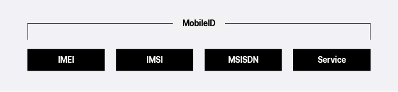
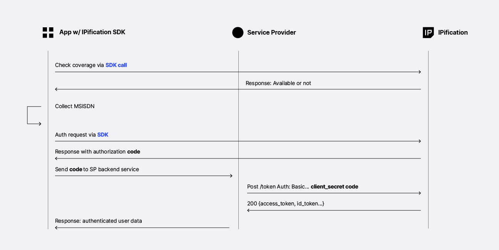
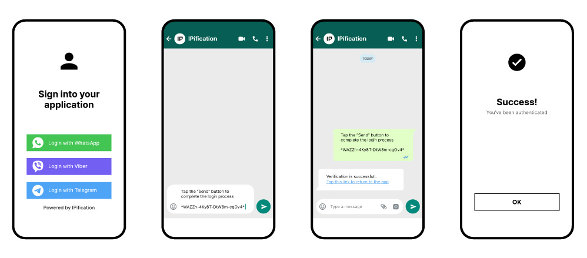
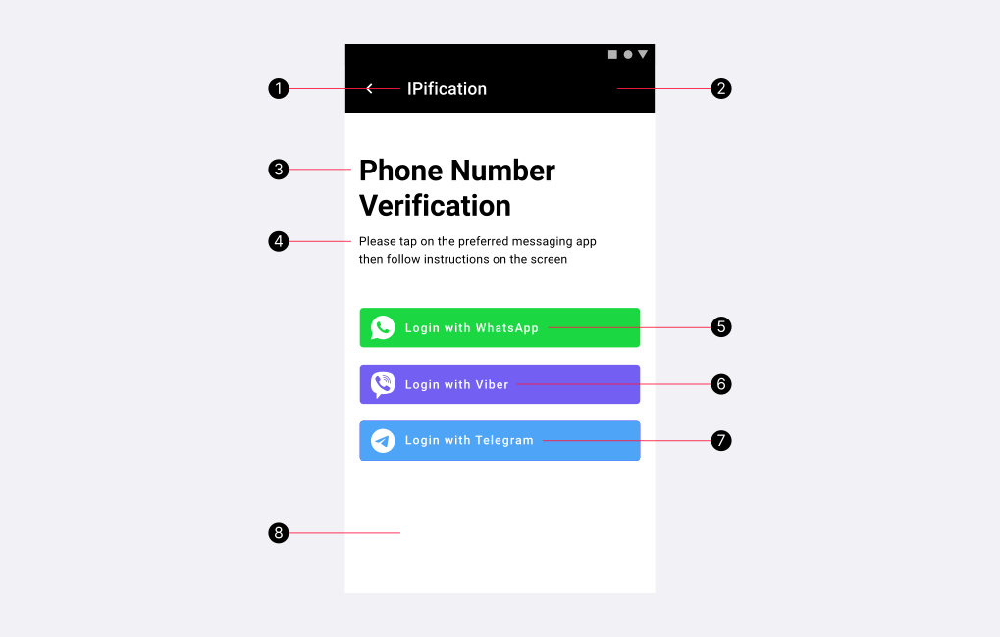
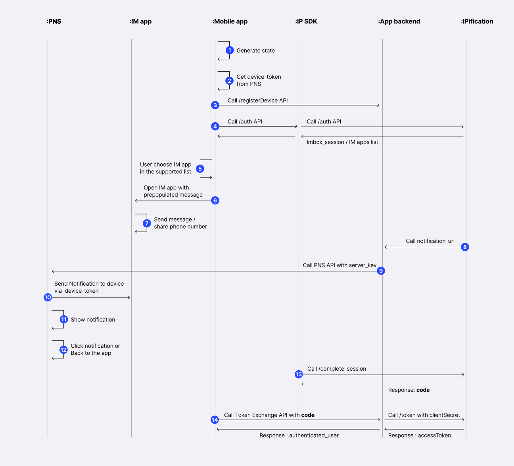

# Flutter Plugin

This document describes the IPification plugin for Flutter and its usage. The main purpose of the SDK is to provide network based authentication for the mobile users.
At the end of the flow, the client will be presented with information if the phone number is verified (field `phone_number_verified`) and / or a `mobile_id` - JWT field which represents the value of IPification unique **MobileID**. 
MobileID is a hashed (nonreversible) value of three network elements with additional service URI as a salt, so end user will have different mobileID’s for the different services



Before authentication is initiated, mobile applications should use IPification **Coverage service**, via SDK, to check if an end user's device and mobile operator is supported for seamless authentication provided by IPification.
If the Coverage API returns a positive response, the application should invoke **Authentication** via SDK and receive `authorization_code` which will be used for token exchange on the **Service Provider** backend service.


This is flow overview:



Mobile applications that implement IPification SDK don’t have to care about if the device is on cellular data or not. SDK will force authentication request to go via cellular data even in cases when device is on WiFi connection. Put it simply - everything you have to do is to call `doAuthorization()` and do authorization code exchange from your backend service.

# I. Add IPification plugin to your Flutter project

## 1. Install Plugin

You can install the `ipification_plugin` package using either the **Git method** or by **downloading it locally**. Follow one of the two options below:

---

#### ✅ **Option 1: Install via Git (Recommended)**

1. Open your `pubspec.yaml` file.  
2. Add the dependency in the following format:


##### 📌 **For Xcode 16 (Bitcode Disabled):**
```yaml
dependencies:
  ipification_plugin:
    git:
      url: https://github.com/bvantagelimited/IPification-Flutter-Plugin-Release.git
      ref: 2.0.27
```

##### 📌 **For XCode under 16 :**
```yaml
dependencies:
  ipification_plugin:
    git:
      url: https://github.com/bvantagelimited/IPification-Flutter-Plugin-Release.git
      ref: 2.0.26
```


3. Run the following command in your terminal:
```bash
flutter pub get
```

---

#### ✅ **Option 2: Install Locally**

If you prefer to use a **local version** of the plugin:

1. **Download the Plugin Source Code:**

```
https://github.com/bvantagelimited/IPification-Flutter-Plugin-Release/archive/refs/tags/2.0.27.zip (for Xcode 16)

or

https://github.com/bvantagelimited/IPification-Flutter-Plugin-Release/archive/refs/tags/2.0.26.zip (for Xcode 15 or older)

```

2. **Extract the ZIP File:**  
Place the extracted folder in your project directory, e.g., `./plugins/IPification-Flutter-Plugin-Release-2.0.27`.

3. **Update `pubspec.yaml` to use the local path:**
```yaml
dependencies:
  ipification_plugin:
    path: ./plugins/IPification-Flutter-Plugin-Release-2.0.27
```

4. Run the following command in your terminal:
```bash
flutter pub get
```

## 2. Configuration Variables

During the onboarding process, IPification will provide you with SDK configuration. The SDK will read this configuration variables then use it during the authentication flow. 

<!-- tabs:start -->
#### **Stage**
```
    void initIPConfiguration() async {
        IPificationPlugin.setEnv(ENV.SANDBOX);
        IPificationPlugin.setClientId("your-stage-client-id");
        IPificationPlugin.setRedirectUri("your-redirect-uri");
    }
```
#### **Production**
```
    void initIPConfiguration() async {
        IPificationPlugin.setEnv(ENV.PRODUCTION);
        IPificationPlugin.setClientId("your-prod-client-id");
        IPificationPlugin.setRedirectUri("your-redirect-uri");
    }
```
<!-- tabs:end -->

- **ClientId** - unique identifier of the client that is generated by IPification and provided to the client in the onboarding process.

- **RedirectUri** - In the onboarding process of the client, redirect uri must be provided, this value can represent wildcard uri and will be used to validate provided `redirect_uri` in the request.<br>
    
    > The format of `redirect_uri` should be `your-package-name-or-bundle-id://path/` or `https://your-domain/path`

    >`redirect_uri` schemes must be lowercase, begin with a letter and be followed by any other letter, number . - or +


# II. IP Authentication Flow

## 1. Collect Mobile Phone Number

To begin the process, the mobile phone number needs to be collected from the user. This step is crucial as it ensures that we have the correct contact information to proceed with the necessary actions. The phone number will be used for verification and further communication.


## 2. Check Coverage

`Check Coverage` is used to check if IPification Solution is available for the submitted user/subscriber

* Import IPification class

    ```dart
    import 'package:ipification_plugin/ipification.dart';
    ```

* Perform to check Coverage with `checkCoverage()` function
    ```dart
    Future<bool> checkCoverage() async {
        try {
            var coverageResponse = await IPificationPlugin.checkCoverageWithPhoneNumber(phoneNumber: input_phone_number);
            return coverageResponse.isAvailable;
        } on PlatformException catch (e) {
            print(e.code + " - " + e.message);
        }
        return Future<bool>.value(false);
    }
    ```
    * `isAvailable == true` - the mobile network of the end user is supported by IPification and you can initiate the Auth process or before it, show an info screen about seamless authentication that will be performed.

    * `getOperatorCode(): String?` - resolved Telco operator. This function returns null by default. Read detail (<a href="#/auth/latest/?id=operator-data-in-json-response" target="_blank">Operator Code</a>)


## 3. Perform IP Authentication

> Use `setScope()` to specify what access privileges are being requested for Access Tokens. For example, use `openid ip:phone_verify` scope will request phone number verification process. For this scope, it is required to send `login_hint` parameter. Read detail (<a href="#/auth/latest/?id=scopes-explained" target="_blank">Scopes Explained</a>)

> If a client wants to validate the phone number, it should be passed via `login_hint​` parameter and IPification will use this value against the resolved value. If values do not match error will be returned at the end of the flow. Phone number should be specified according to the E.164 number formatting (http://en.wikipedia.org/wiki/E.164) without leading `+` sign.

> Optionally, the client can send a `state` param via `setState()` method which represents the session identifier so client and IPification can track sessions across the flow. This is generated by client application. If client application does not provide this value, IPification will generate random state when authentication starts.


Perform IP authentication with `doAuthorization(loginHint: input_phone_number)` function:

```dart
Future<void> doAuthentication() async {
    String authCode;
    try {
        IPificationPlugin.setScope(value: "openid ip:phone_verify");
    
        var authResponse = await IPificationPlugin.doAuthentication(loginHint: input_phone_number);
        authCode = authResponse.code;
    } on PlatformException catch (error) {
        print( error.code + "\n" + error.message);
    }
    if (authCode != null) {
        // TODO
        // call your Token Exchange API with {authCode}
    } else {
        // TODO
        // problem, please try again or handle it with another auth service
    }
}
```

> The response of `doAuthorization()` function will be a `code` - Authorization code or an `error`.<br> `code:` value generated by IPification server. 

> This value will be used as authorization in server to server call from client to IPification.


## 4. Exchange the authorization code to get access_token (backend side)<a id="token-exchange"></a>


### 4.1 Exchange the authorization_code
1. After the 3rd step above, your application has the authorization `code`, which you will use to exchange it for the `access token`. Code exchange **must** be performed from your backend service.<br>
2. Your application needs to send `code` to your backend service.<br>
3. Your backend needs to prepare a POST request API to the IPification’s token endpoint (`/token`) with the following parameters:<br>
   - **code** - The application includes the authorization code, it was given in the redirect<br>
   - **client_id** - The application’s client ID<br>
   - **client_secret** - The application’s client secret. This ensures that the request to get the access token is made only from the application, and not from a potential attacker that may have intercepted the authorization code
   - **grant_type** - value is `authorization_code`
   - **redirect_uri** 


<!-- tabs:start -->
#### **Stage**
```
POST /auth/realms/ipification/protocol/openid-connect/token 
HTTP/1.1
Host: api.stage.ipification.com
Content-Type: application/x-www-form-urlencoded

Body in x-www-form-urlencoded:
redirect_uri={your-redirect-uri}
grant_type=authorization_code
code={auth-code}
client_id={your-STAGE-client-id}
client_secret={your-STAGE-client-secret}
```
#### **Production**

```
POST /auth/realms/ipification/protocol/openid-connect/token 
HTTP/1.1
Host: api.ipification.com
Content-Type: application/x-www-form-urlencoded

Body in x-www-form-urlencoded:
redirect_uri={your-redirect-uri}
grant_type=authorization_code
code={auth-code}
client_id={your-PROD-client-id}
client_secret={your-PROD-client-secret}
```
<!-- tabs:end -->
 
 
Response will contain `access_token`, `refresh_token` and `id_token`.<br><br>
Next, your backend service needs to prepare a POST request API to `/userinfo` or Decoded `ID Token` will contain IPification related claims.

### 4.2 Access User Info with access_token

```bash
curl --location --request POST '/auth/realms/ipification/protocol/openid-connect/userinfo' \
     -H "Content-Type: application/x-www-form-urlencoded" \
     -d "access_token=$ClientAccessToken"
```

Data: <br/>
###### Scope: ip:phone_verify<a id="ip-phone-verify"></a>

```json
{
"sub": "99dd91d1-c949-433c-bd9e-0682eb6d6d26",
"login_hint": "381123456789",
"phone_number_verified": "true"
}
```
or 
###### Scope: ip:phone<a id="ip-phone"></a>
```json
{
"sub": "99dd91d1-c949-433c-bd9e-0682eb6d6d26",
"phone_number": "381123456789"
}
```

- **phone_number_verified** - true if the submitted phone number is matched, false otherwise. If the value is false it indicates the user has inputted an incorrect phone number and this case **MUST** be handled accordingly, for example reject authentication.<br>
- **phone_number** - resolved End-User phone number specified according to the E.164 number formatting (http://en.wikipedia.org/wiki/E.164) without leading + sign. <br>
- **login_hint** - original value that was submitted in the auth request.
> Regarding `login_hint` in response, it is **MANDATORY** that Client validates this value with the value initially sent in the auth request. If values **DO NOT MATCH**, it is a sign that request was tampered with and authentication should be marked as an **INVALID**.

- **mobile_id** - field represents IPification MobileID that can be used as a network identifier of a user.<br>
- **sub** - id of the user, called _subject_ in OpenID. In case when the phone number is not successfully verified (provided MSISDN does not match the resolved end user’s MSISDN) `sub` will have value ‘anonymous’.<br>


## 5. Unregister Cellular Network (Android only)
Forcing an initial authentication request, via cellular data when the user is on WiFi, on some devices can cause a 3/4G icon freeze on the status bar even when SDK finishes Auth request. Even if this happens, all other requests will go via the default network provider but users can be confused with that 3/4G icon when the device is on WiFi.
In order to have a nice UX without any end users confusion, you should unregister Cellular Network after usage. On your screen that implements IPification SDK, add this code to componentWillUnmount() method to unregister cellular network before switching to another screen.
```dart
@override
void deactivate() {
   if (Platform.isAndroid) {
     IPificationPlugin.unregisterNetwork();
   }
   super.deactivate();
 }
```


# III. IM Authentication Flow

In case coverage is not available (Mobile Network has not yet integrated the IPification Solution - _GMiDbox™_ ), IPification provides a fallback to authentication via `Instant Messaging (IM) apps`. IPification currently supports three major IM apps: `WhatsApp`, `Viber` and `Telegram`.
With more alternative methods available, your users will be able to choose the channel they want to use and complete the verification steps on the platform they prefer.

!> No need to call **CheckCoverage** since IM Authentication works on all networks.

There are 2 options for IM : `IM Login` (Quick IM Authentication) and `Phone Number Verification with IM`:


### IM Login
When using IM apps for the authentication IPification can provide resolved phone number. With this option, clients can significantly increase the security and user experience of their mobile/web apps, also improving user acquisition, engagement, and retention rates.
For quick IM auth, `login_hint` is not required and the scope value should be `scope=openid ip:phone`.

In order to use this feature, call `doIMAuthentication(channel: channelValue)` function.



### Phone Number Verification with IM
IM apps can be used to perform phone number verification by adding `scope` = `ip:phone_verify` and providing `login_hint` along with `channel` parameter that will define type of the Auth.

In order to use this feature, call `doAuthenticationWithChannel(channel: channelValue, loginHint: inputPhoneNumber)` function.


## 1. Setup
### - iOS
#### 1. Configure Info.plist
To open a third-party messaging app from your application, you need to add their url schemes to `LSApplicationQueriesSchemes` key in your `plist` file.
After iOS 14, to open Associated Domain URLS in a device that uses a different default browser than Safari, you also need to add https as url scheme.<br/>
Open your `Info.plist` as source code and insert the following XML snippet into the body of your file just before the final `dict` element.
```
 <key>LSApplicationQueriesSchemes</key>
 <array>  
    <string>whatsapp</string>  
    <string>telegram</string>  
    <string>viber</string>  
    <string>https</string>
 </array>
```

#### 2. Universal Link
After a successful validation with a third-party messaging app, the user needs to return to the main app.
If your application has an `Associated Domain`, we can add a `Universal Link` to our message for an easy and quick redirect. Every service can set up custom success messages and include deep links to them. Setup is done via IPification Dashboard.

For setting up your Universal Link, check document: (<a href="https://developer.apple.com/ios/universal-links/" target="_blank">Universal Links</a>)
and (<a href="https://developer.apple.com/documentation/Xcode/supporting-associated-domains" target="_blank">Associated Domain</a>)


### - Android
#### 1. Update AndroidManifest

1. Open the `/android/app/src/main/AndroidManifest.xml` file.

2. Add the following meta-data elements, an activity for IPification:

```xml
 <activity
    android:name="com.ipification.mobile.sdk.im.ui.IMVerificationActivity"
    android:exported="true"
    android:theme="@style/IPTheme"
    android:windowSoftInputMode="adjustPan"
    android:launchMode="singleInstance">
    <intent-filter android:autoVerify="true">
      <action android:name="android.intent.action.VIEW" />
      <category android:name="android.intent.category.BROWSABLE" />
      <category android:name="android.intent.category.DEFAULT" />
      <!--todo: set up Android App Link-->
      <data android:host="your_deep_link_host"
            android:scheme="https" />
    </intent-filter>
</activity>
```

** An Android App Link is a deep link based on your website URL that has been verified to belong to your website. So click one of these immediately opens your app if it's installed — the disambiguation dialog does not appear. Though the user may later change their preference for handling these links. For verifying your App Link check document: <a href="https://developer.android.com/training/app-links/verify-site-associations" target="_blank">Verify Android App Links</a>


## 2. Start Authentication<a id="im-authentication-api"></a>
IM Authentication Init is almost the same as IP Auth Init in [IPification Flow](#authentication-api). 

In order to enable IM fallback Auth, one extra parameter `channel` is required when user triggering first authentication/authorization request. Multiple channel values may be used by creating a space-delimited, case-sensitive list of channel values. All supported values are: `ip`, `wa`, `viber` or `telegram`. By sending channel values service will offer type of the Authentication to the end user:<br>
  - `ip` - default IPification Auth - standard seamless flow described in [IPification Authentication Flow](#authentication-api)
  - `wa` - auth with WhatsApp app <a id="im-supported-channels"></a>
  - `viber` - auth with Viber app
  - `telegram` - auth using Telegram app
    - If the channel contains `ip` value, Auth will be attempted via IP Auth as a primary channel if Coverage is supported, otherwise fallback to IM will be offered. 

1. Set Scope 
2. Set State (This is required if you want to send success message via notification, see Setup Push Notifications <a id="push-notifications"></a> ) 
3. Perform authentication with `doIMAuthentication(channel: channelValue)` function from `IPificationPlugin` class


```dart
IPificationPlugin.setScope(value: "openid ip:phone");
// IPificationPlugin.setState(value: state);
var authResponse = await IPificationPlugin.doIMAuthentication(
          channel: "wa telegram viber");
if (authResponse?.code?.isNotEmpty != null) {
    // await IPNetworkManager.doTokenExchange(
        // authResponse.code!,
        // (success) => {},
        // (fail) => {}
        //);
} else {
    // TODO  
    // check if user cancel from IM Screen
    if (e.code == IP_AUTHENTICATE_IM_CANCEL) {
        // for example : dismiss loadingView
        // context.loaderOverlay.hide();
        return;
    }
    // otherwise: error - fallback to another authentication service flow
}

```


8. The response of `doIMAuthentication()` function will be a `code` - Authorization code or an `error`.
    - `code`: value generated by IPification server. This value will be used as authorization in server to server call (`/token` endpoint) from Client to IPification. 

9. Call `Token Exchange` API <br/>
Token Exchange call is a standard API call described in [Token Exchange](#token-exchange) section.

## 4. Setup IM Theme and Locale
Use those two functions to change theme and texts on IM page:
<!-- tabs:start -->

#### **iOS**

```dart
    IPificationPlugin.updateIOSLocale(
        "IPification",
        "Phone Number Verify",
        "Please tap on the preferred messaging app then follow instructions on the screen",
        "Login with WhatsApp",
        "Login with Telegram",
        "Login with Viber",
        "Cancel");
    IPificationPlugin.updateIOSTheme(
        "#000000", "#000000", "#000000", "#000000", "#ffffff");
    
```


1. **titleBar** - title bar (text, color)
2. **mainTitle** - IM page title (text, color)
3. **description** - short description (text, color)
4. **whatsappBtnText** - WhatsApp button (text)
5. **viberBtnText** - Viber button (text)
6. **telegramBtnText** - Telegram button (text)
7. **backgroundColor** - IM background color 
7. **cancelBtn** - Cancel button (text, color)


#### **Android
**

```dart
    IPificationPlugin.updateAndroidLocale(
        "IPification",
        "Phone Number Verification",
        "Please tap on the preferred messaging app then follow instructions on the screen",
        "Login with WhatsApp",
        "Login with Telegram",
        "Login with Viber");

    IPificationPlugin.updateAndroidTheme("#ffffff", "#ffffff", "#c91636");


```



1. **toolbarTitle** and **toolbarTextColor** - setup title text and color
2. **toolbarColor** and **toolbarVisibility** - toolbar background color and option to hide it completely
3. **mainTitle** - IM page title
4. **description** - short description
5. **whatsappBtnText** - text on WhatsApp button
6. **telegramBtnText** - text on Telegram button
7. **viberBtnText** - text on Viber button
8. **backgroundColor** - background color

<!-- tabs:end -->


## 5. Setup Push Notifications <a id="push-notifications"></a> 

In order to return the user to the Mobile App, Clients can use predefined success messages which can contain instructions and deep link to the App.<br>
Optionally, Clients can use push notifications to return the user to the App and to finish Auth flow.
Those are steps in order to implement push notifications:
1. Expose one HTTP POST endpoint where IPification will send a notification when the user sends a message from IM App. You will use this notification to trigger a push notification to the App. More details in [Client Notification URL Setup](#client-notification-url) section.
2. Setup Push Notification service that will deliver notification message to the mobile device. You can build this service manually or alternatively use cloud services like Firebase (https://firebase.google.com/docs/android/setup) or OneSignal (https://onesignal.com)

This is IM Auth flow with Push Notifications:



1. <a id="push-notifications-state-gen"></a>Mobile App needs to generate `state` value, which represents the session identifier so Client and IPification can track sessions across the flow. It is mandatory to use this value for the Auth init also - [step 4](#push-notifications-init-auth).
2. Mobile App should issue new `device_token` from Push Notification Service (PNS)
3. Register device to the App backend by sending `device_token` and `state` pair
4. <a id="push-notifications-init-auth"></a>Initiate Auth flow by invoking IP Plugin function `doAuthentication()` ([Start IM Auth](#im-authentication-api)). Since this is IM flow user will be redirected to the screen with IM buttons
5. User chooses one of the IM apps that he prefers
6. IM App is opened with a pre-populated message
7. User sends a message or follows instructions on the screen in order to complete auth process
8. IPification will notify the Client on a predefined URL that auth flow on the mobile App can continue. This notification is a flag to trigger a push notification to the App. More details in [Client Notification URL Setup](#client-notification-url) section.
9. App backend will send an API call to the PNS to trigger push notification on the mobile device with predefined `device_token`. More details in [Send Push Notifications](#send-push-notification) section.
10. Push Notification Service will deliver notification to the device
11. Push Notification pop-ups on the device
12. User clicks on the notification and Mobile App comes into the focus. More details on [Setup and handle Push Notifications](#handle-push-notification) section.
13. When App is into the focus, IPification SDK will try to complete auth session. The response will be authorization `code`
14. In this moment Client App has a `code` - this value will be used as authorization in server to server call from a Client to IPification token endpoint. Token Exchange call is a standard API call described in [Token Exchange](#token-exchange) section.

### Setup your PNS & Get PNS Device Token (Step 2.)
Setup Push Notification service that will deliver notification message to the mobile device. You can build this service manually or use cloud services like FCM (https://firebase.flutter.dev/docs/messaging/notifications/) or OneSignal (https://documentation.onesignal.com/docs/flutter-sdk-setup)

### Setup and handle Push Notification data<a id="handle-push-notification"></a>
Implement/update your Push Notification Service to handle IPification Push Notification data.


Check out our sample App which uses Push Notifications:
```
https://github.com/bvantagelimited/mobile-sdk-showcase-apps/tree/2.0.0/ipification-sdk-flutter-dart

```

This is our guideline how to integrate `FCM` and handle notification for Flutter:

```
https://github.com/bvantagelimited/mobile-sdk-showcase-apps/wiki/IPification-Flutter-Plugin---FCM-Notification-Integration
```

### Setup Client Notification URL (Backend part - Step 8.) <a id="client-notification-url"></a>
IPification can notify the Client about the completed process on IM App by sending one HTTP POST request on a predefined URL.
The client should expose one HTTP POST endpoint where IPification will send a notification when the user sends the message from IM App. You will use this notification to trigger a push notification to the App.<br>
Those are params that will be sent in HTTP POST:

<!-- tabs:start -->
#### **HTTP**

```HTTP
POST /example/notification
HTTP/1.1
Host: example.client-service.com
Content-Type: application/json

Body in JSON:
{
  "state" : "{state-val}",
  "notification_type" : "{type-value}",
  "channel" : "{channel-value}"
}
```

#### **cURL**

```bash
curl --location --request POST 'https://example.client-service.com/example/notification' \
--header 'Content-Type: application/json' \
-d \
'{
  "state" : "{state-val}",
  "notification_type" : "{type-value}",
  "channel" : "{channel-value}"
}'\
```
<!-- tabs:end -->

1. `state` - this is the state parameter that was created in [step 1](#push-notifications-state-gen) and also the same value used in [Auth Init request](#push-notifications-init-auth)
2. `notification_type` - two possible values: 
    - **session_completed** - IM session is successfully finished and Auth flow can continue
    - **session_expired** - user sent prepopulated IM message after a predefined timeout of 15 seconds. Auth flow cannot be continued and the Client should instruct the user to initiate Auth again
3. `channel` - this is the channel that the user used to do authentication. Values are defined by API channel parameter - read more about it: [IM chanels](#im-supported-channels)

### Send Push Notification to user's device (Backend part - Step 9.)<a id="send-push-notification"></a>
Set up a service to call Push Notification API and send a `DATA` message notification to the user's device. Check out our sample project with Firebase implementation (https://firebase.google.com/docs/cloud-messaging/android/receive):

>Sample NodeJS project:<br>
https://github.com/bvantagelimited/mobile-sdk-showcase-apps/tree/master/ipification-merchant-service


# IV. Scope
All supported values of scope are: `openid`, `ip:phone_verify`, `ip:mobile_id`, `ip:phone`, `ip:profile`. 


`openid` is required scope that informs the Authorization Server that the Client is making an OpenID Connect request. One or more of the IPification custom scopes are required also.

`ip:phone_verify`, `ip:profile` are required to send `login_hint` parameter.

Check here for more detail (<a href="#/auth/latest/?id=scopes-explained" target="_blank">Scopes Explained</a>)
# V. Restrictions
**1. Flutter**:

Supported flutter version >= 2.12.0 (with `null-safety`)

**2. Android**:

IPification SDK requires a minimum 16 Android API version (version 4.1 and up).
Functionality when SDK forces Auth request to go via cellular data will require Android SDK version min 21 (Version 5.0 - LOLLIPOP).
For devices with an older version than LOLLIPOP but above 4.0, we support devices that **enable Cellular network only**, otherwise SDK will throw `AuthenticationUnsupportedException` when it tries to force requests via cellular data.

**3. iOS**:

IPification SDK requires a minimum iOS 10.0


# VI. Sample Application


Check out our sample App to see how it works:


```
https://github.com/bvantagelimited/mobile-sdk-showcase-apps/tree/2.0.0/ipification-sdk-flutter-dart
```
