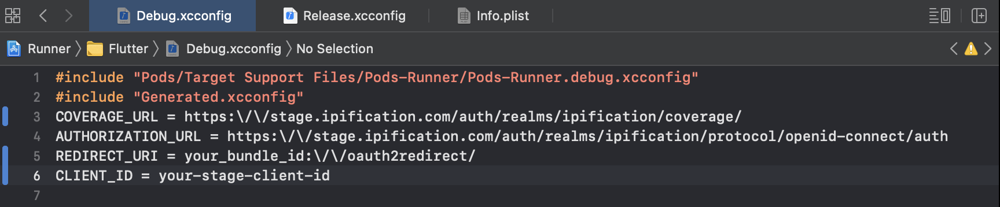
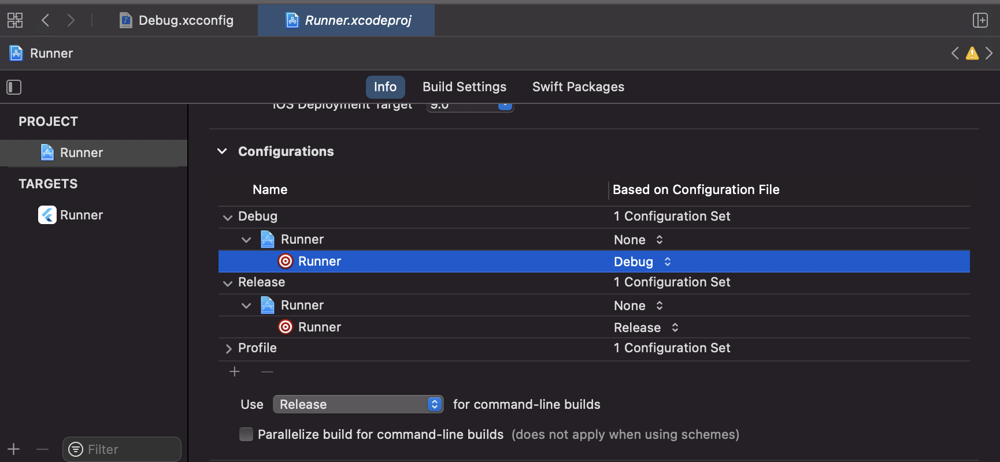
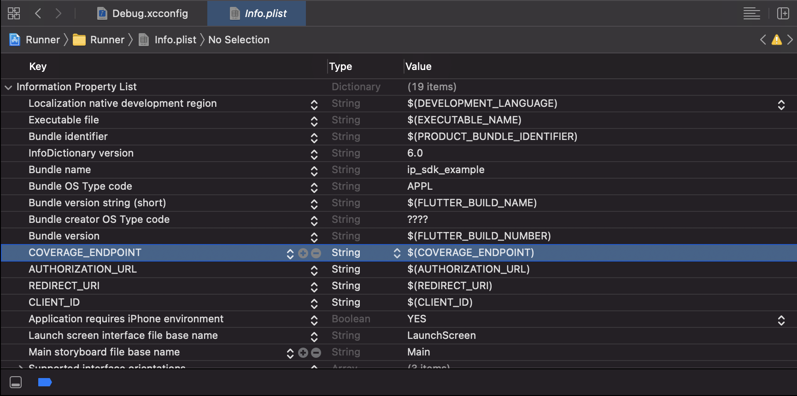

# Flutter Plugin

This document describes the IPification plugin for Flutter and its usage. The main purpose of the SDK is to provide network based authentication for the mobile users.
At the end of the flow, the client will be presented with information if the phone number is verified (field `phone_number_verified`) and / or a `mobile_id` - JWT field which represents the value of IPification unique **MobileID**. 
MobileID is a hashed (nonreversible) value of three network elements with additional service URI as a salt, so end user will have different mobileID’s for the different services


Before authentication is initiated, mobile applications should use IPification **Coverage Service**, via SDK, to check if an end user's device and mobile operator is supported for seamless authentication provided by IPification.
If the Coverage API returns a positive response, the application should invoke **Authentication** via SDK and receive `authorization_code` which will be used for token exchange on the **Service Provider** backend service.


This is flow overview:


Mobile applications that implement IPification SDK don’t have to care about if the device is on cellular data or not. SDK will force authentication request to go via cellular data even in cases when device is on WiFi connection. Put it simply - everything you have to do is to call `doAuthorization()` and do authorization code exchange from your backend service.

# Add IPification plugin to your Flutter project

## 1. Install Plugin
Add the IPification SDK as a dependency to your `pubspec.yaml` file: 

```yaml
dependencies:
 ip_sdk:
    path: ipification_plugin_folder_path (for example: `path: ../ipification_flutter/`)
```
## 2. Set Up Variables

During the onboarding process IPification will provide you with SDK configuration. The SDK will read this configuration then use it during the authentication flow. 
- **coverage_url** - Coverage API is used to check if IPification Solution is available for the submitted user/subscriber. By submitting the public IP of the user that visits/uses the client/RP website or application, IPification Solution is able to resolve if the Seamless Authentication is available or not. This can be useful to clients in order to render or show different pages/options to the users based on the availability of the IPification Solution.

- **authorization_url** - Authorization API is used for authorization flow

- **redirect_uri** - In the onboarding process of the client, redirect uri must be provided, this value can represent wildcard uri and will be used to validate provided `redirect_uri` in the request.<br>
    
    > The format of `redirect_uri` should be `your-package-name-or-bundle-id://oauth2redirect/`

    >`redirect_uri` schemes must be lowercase, begin with a letter and be followed by any other letter, number . - or +

- **client_id** - unique identifier of the client that is generated by IPification and provided to the client in the onboarding process.


We support by `configuration file` or by `setters` directly

### A. By setters

Set up `CheckCoverageUrl`, `AuthorizationUrl`, `ClientId`, `RedirectUri` before call `doAuthorization()`

<!-- tabs:start -->
#### **Stage**
```
    IpSdk.setCheckCoverageUrl("https://stage.ipification.com/auth/realms/ipification/coverage");
    IpSdk.setAuthorizationUrl("https://stage.ipification.com/auth/realms/ipification/protocol/openid-connect/auth");
    IpSdk.setClientId("your-stage-client-id");
    if (Platform.isAndroid) {
        IpSdk.setRedirectUri("your-stage-package-name://oauth2redirect/");
    }else{
        IpSdk.setRedirectUri("your-stage-bundle-id://oauth2redirect/");
    }
```
#### **Production**
```
    IpSdk.setCheckCoverageUrl("https://api.ipification.com/auth/realms/ipification/coverage");
    IpSdk.setAuthorizationUrl("https://api.ipification.com/auth/realms/ipification/protocol/openid-connect/auth");
    IpSdk.setClientId("your-prod-client-id");
    if (Platform.isAndroid) {
        IpSdk.setRedirectUri("your-prod-package-name://oauth2redirect/");
    }else{
        IpSdk.setRedirectUri("your-prod-bundle-id://oauth2redirect/");
    }
```
<!-- tabs:end -->


### B. Or By configuration File
#### 1. Android

* Open `/android`

* Create `ipification-services.json` file in `/src/main/assets/` folder, then put your client information. Configuration is in JSON format, e.g:

<!-- tabs:start -->
#### **Stage**
```json
{
"coverage_url": "https://stage.ipification.com/auth/realms/ipification/coverage",
"authorization_url": "https://stage.ipification.com/auth/realms/ipification/protocol/openid-connect/auth",
"redirect_uri": "your_package_name://oauth2redirect/",
"client_id":"your-stage-client-id"
}
```
#### **Production**
```json
{
"coverage_url": "https://api.ipification.com/auth/realms/ipification/coverage",
"authorization_url": "https://api.ipification.com/auth/realms/ipification/protocol/openid-connect/auth",
"redirect_uri": "your_package_name://oauth2redirect/",
"client_id":"your-prod-client-id"
}
```
<!-- tabs:end -->
    
#### 2. iOS

* Open `/ios/{{project-name}}.xcworkspace` with **XCode**

* Create or update your configuration files: `Debug.xcconfig` / `Release.xcconfig` , then put your client information. For example:

<!-- tabs:start -->
#### **Stage**
```xcconfig
COVERAGE_URL = https:\/\/stage.ipification.com/auth/realms/ipification/coverage/
AUTHORIZATION_URL = https:\/\/stage.ipification.com/auth/realms/ipification/protocol/openid-connect/auth
REDIRECT_URI = your_bundle_id:\/\/oauth2redirect/
CLIENT_ID = your-stage-client-id
```
#### **Production**
```xcconfig
    COVERAGE_URL = https:\/\/api.ipification.com/auth/realms/ipification/coverage/
    AUTHORIZATION_URL = https:\/\/api.ipification.com/auth/realms/ipification/protocol/openid-connect/auth
    REDIRECT_URI = your_bundle_id:\/\/oauth2redirect/
    CLIENT_ID = your-prod-client-id
```
<!-- tabs:end -->


* Now go to your project, click on `Info` tab, under the configurations section expand the list and select your xconfig file `Debug / Release` from the dropdown box: <br/>



* Add these variables in `Info.plist`

    | key                |  type   | value                 |
    |--------------------|---------|-----------------------|
    | COVERAGE_URL  |  String | $(COVERAGE_URL)  |
    | AUTHORIZATION_URL  |  String | $(AUTHORIZATION_URL)  |
    | REDIRECT_URI       |  String | $(REDIRECT_URI)       |
    | CLIENT_ID          |  String | $(CLIENT_ID)          |



# Do the Authentication Flow
## 1. Check Coverage API

`Coverage API` is used to check if IPification Solution is available for the submitted user/subscriber

* Import IPification classes

    ```dart
    import 'package:flutter/services.dart';
    import 'package:ip_sdk/ip_sdk.dart';
    ```

* Perform to check Coverage with `checkCoverage` function
    ```dart
    Future<void> checkCoverage() async {
        try {
            var coverageResponse = await IpSdk.checkCoverage();
            bool isAvailable = coverageResponse.isAvailable;
            print("supported network: $isAvailable");
            if(isAvailable){
                // call authentication API
            }else{
                // not supported, fallback it to another auth service flow
            }
        } on PlatformException catch (e) {
            isAvailable = false;
            var errMessage = e.code + "-" + e.message;
        }
    }
    ```
    * `isAvailable == true` - the mobile network of the end user is supported by IPification and you can initiate the Auth process or before it, show an info screen about seamless authentication that will be performed.

    * `getOperatorCode(): String?` - resolved Telco operator. This function returns null by default. Read detail (<a href="#/auth/latest/?id=operator-data-in-json-response" target="_blank">Operator Code</a>)

    > Use `IpSdk.checkCoverageWithPhoneNumber(phoneNumber: input_phone_number)` to checkCoverage with `phone` query param. To use this function, client need to collect Mobile Phone Number (step 2) before do check Coverage. Read detail (<a href="#/auth/latest/?id=coverage-api" target="_blank">Coverage API</a>)

## 2. Collect Mobile Phone Number

If the client wants to validate the user’s phone number (`MSISDN`) but doesn’t have it already, the client’s app should prompt the user to enter it in this step. Details on how to pass `MSISDN` to the authentication request are explained in step 3.

## 3. Authentication API

> Use `setScope()` to specify what access privileges are being requested for Access Tokens. For example, use `openid ip:phone_verify` scope will request phone number verification process. For this scope, it is required to send `login_hint` parameter. Read detail (<a href="#/auth/latest/?id=scopes-explained" target="_blank">Scopes Explained</a>)

> If a client wants to validate the phone number, it should be passed via `login_hint​` parameter and IPification will use this value against the resolved value. If values do not match error will be returned at the end of the flow. Phone number should be specified according to the E.164 number formatting (http://en.wikipedia.org/wiki/E.164) without leading `+` sign.

> Optionally, the client can send a `state` param via `setState()` method which represents the session identifier so client and IPification can track sessions across the flow. This is generated by client application. If client application does not provide this value, IPification will generate random state when authentication starts.


Perform Authentication with `doAuthorization()` function:

```dart
Future<void> doAuthentication() async {
    var authCode = "";
    try {
        IpSdk.setScope(value: "openid ip:phone_verify");
        // IpSdk.setState(value: "custom_state");
        // IpSdk.addQueryParam(key: "your_custom_key", value: "your_custom_value");
    
        var authResponse = await IpSdk.doAuthentication(loginHint: input_phone_number);
        // get code and state
        authCode = authResponse.code;
        // var state = authResponse.state;
    } on PlatformException catch (error) {
        var errMessage = error.code + " - " + ( error.message ?? "" );
    }
    if (authCode != null) {
        // TODO
        // call your Token Exchange API with {authCode}
    } else {
        // TODO
        // problem, fallback it to another auth service flow

    }
}
```

> The response of `doAuthorization()` function will be a `code` - Authorization code or an `error`.<br> `code:` value generated by IPification server. 

> This value will be used as authorization in server to server call from client to IPification.


## 4. Exchange the authorization code for an access token (backend side)

1. After the 3rd step above, your application has the authorization `code`, which you will use to exchange it for the `access token`. Code exchange **must** be performed from your backend service.<br>
2. Your application needs to send `code` to your backend service.<br>
3. Your backend needs to prepare a POST request API to the IPification’s token endpoint (`/token`) with the following parameters:<br>
   - **code** - The application includes the authorization code it was given in the redirect<br>
   - **client_id** - The application’s client ID<br>
   - **client_secret** - The application’s client secret. This ensures that the request to get the access token is made only from the application, and not from a potential attacker that may have intercepted the authorization code

Example request:
```
POST /auth/realms/ipification/protocol/openid-connect/token 
HTTP/1.1
Host: api.ipification.com
Content-Type: application/x-www-form-urlencoded

Body in x-www-form-urlencoded:
redirect_uri=https://www.clientapp.com/callback
grant_type=authorization_code
code=81e2a518-e2ee-47dd-8ef4-833c92bc5f53.d684b91b-92c0-470e-b477
client_id=example-client
client_secret=64accf15-ea...bc-81b96197ef7e
```
 
Response will contain `access_token`, `refresh_token` and `id_token`.<br>
Decoded id token will contain IPification related claims:

```json
{
 "sub" : "429bf6d343e5b6475d351890899a508f7eeea8dd6c8b7feb77f68dac0700bda9",
 "login_hint" : "381123456789",
 "phone_number_verified" : "true"
}
```

- **sub** - id of the user, called _subject_ in OpenID. In case when the phone number is not successfully verified (provided MSISDN does not match the resolved end user’s MSISDN) `sub` will have value ‘anonymous’.<br>
- **login_hint** - original value that was submitted in the auth request.
- **phone_number_verified** - true if the submitted phone number is matched, false otherwise. If the value is false it indicates the user has inputted an incorrect phone number and this case **MUST** be handled accordingly, for example reject authentication.<br>
- **mobile_id** - field represents IPification MobileID that can be used as a network identifier of a user.<br>
> Regarding `login_hint` in response, it is **MANDATORY** that Client validates this value with the value initially sent in the auth request. If values **DO NOT MATCH**, it is a sign that request was tampered with and authentication should be marked as an **INVALID**.

## 5. Unregister Cellular Network (Android only)
Forcing an initial authentication request, via cellular data when the user is on WiFi, on some devices can cause a 3/4G icon freeze on the status bar even when SDK finishes Auth request. Even if this happens, all other requests will go via the default network provider but users can be confused with that 3/4G icon when the device is on WiFi.
In order to have a nice UX without any end users confusion, you should unregister Cellular Network after usage. On your screen that implements IPification SDK, add this code to componentWillUnmount() method to unregister cellular network before switching to another screen.
```dart
@override
void deactivate() {
   if (Platform.isAndroid) {
     IpSdk.unregisterNetwork();
   }
   super.deactivate();
 }
```
# Scope
All supported values of scope are: `openid`, `ip:phone_verify`, `ip:mobile_id`, `ip:phone`, `ip:profile`. 


`openid` is required scope that informs the Authorization Server that the Client is making an OpenID Connect request. One or more of the IPification custom scopes are required also.

`ip:phone_verify`, `ip:profile` are required to send `login_hint` parameter.

Check here for more detail (<a href="#/auth/latest/?id=scopes-explained" target="_blank">Scopes Explained</a>)
# Restrictions
**1. Flutter**:

Supported version >= 1.20.0

**2. Android**:

IPification SDK requires a minimum 16 Android API version (version 4.1 and up).
Functionality when SDK forces Auth request to go via cellular data will require Android SDK version min 21 (Version 5.0 - LOLLIPOP).
For devices with an older version than LOLLIPOP but above 4.0, we support devices that **enable Cellular network only**, otherwise SDK will throw `AuthenticationUnsupportedException` when it tries to force requests via cellular data.

**3. iOS**:

IPification SDK requires a minimum iOS 10.0


# Sample Application

Check out our sample application source code to see how it work:
<!-- tabs:start -->
#### **Dart**
```
https://github.com/bvantagelimited/mobile-sdk-showcase-apps/tree/master/ipification-sdk-flutter-dart
```

<!-- tabs:end -->